<p align="center">
  <a></a>
  &nbsp;
  <a></a>
</p>

# CrewAI × Kafka — A Choreographed Deep-Research System

Give this system a field (for example *finance*) and a process (for example
*procure-to-pay*), and it produces an executive-ready research report on that
topic. Three AI agents do the work: one researches the web, one validates the
findings, and one writes the report.

The interesting part is how they cooperate. The agents never call each other.
Each one runs in its own Docker container and communicates only by reading and
writing messages on Apache Kafka topics. There is no central orchestrator
deciding what runs when — the workflow emerges from what each agent does when a
message lands on the topic it listens to. The result is a small but complete
distributed system that runs on a laptop.

This repository is meant as a learning example: a clear, hackable demonstration
of how CrewAI agents and Apache Kafka combine into an event-driven pipeline. It
is intentionally simple. The [Extend it](#extend-it) section suggests ways to
turn it into something more capable.

## Table of contents
- [Background](#background)
- [Architecture](#architecture)
- [The agents](#the-agents)
- [Configuring the agents and the system](#configuring-the-agents-and-the-system)
- [Kafka topics and schemas](#kafka-topics-and-schemas)
- [How a request flows through the system](#how-a-request-flows-through-the-system)
- [Which LLMs it uses, and why](#which-llms-it-uses-and-why)
- [AWS Bedrock setup](#aws-bedrock-setup)
- [Running it](#running-it)
- [Using the web UI](#using-the-web-ui)
- [Stopping it](#stopping-it)
- [Observability](#observability)
- [Shift-left: processing the data at the source](#shift-left-processing-the-data-at-the-source)
- [Extend it](#extend-it)
- [Repository layout](#repository-layout)

## Background

If some of these terms are new, here is the short version.

**Agentic AI.** An *agent* is a large language model given a role, a goal, and a
set of tools. Instead of answering a single prompt, it works in a loop — reason,
take an action with a tool, observe the result, repeat — until the task is done.
The agents here use a web-search tool to gather evidence before they write.

**CrewAI.** An open-source Python framework for building agents and grouping them
into "crews." The common pattern is one crew of several agents running together
in a single process. This project uses CrewAI differently: each service is a crew
of just one agent, and the larger "team" is assembled across the network by Kafka.

**Apache Kafka.** A distributed, append-only log. Producers publish messages to
named *topics*; consumers read from those topics independently and at their own
pace. It is the durable backbone that lets the agents stay decoupled — they don't
need to be running at the same time or know about one another.

**Apache Flink (stream processing).** A stream processor that reads from Kafka
topics, transforms records as they arrive, and writes the result back to Kafka —
continuously, with no batch step. Here, Confluent Platform Flink turns the raw
agent-activity log into a clean, enriched stream the moment each event is produced
(see [Shift-left](#shift-left-processing-the-data-at-the-source)).

**Shift-left.** Doing the data work — cleaning, shaping, enriching, governing —
*close to the source* as data is produced, rather than re-doing it downstream in
every system that consumes it. This project shifts left with Flink: it computes
per-call latency and trims the log stream once, in motion, so the UI and the
Elasticsearch/Kibana dashboard both consume a ready-to-use data product.

**Choreography vs. orchestration.** With orchestration, a central controller
tells each service what to do and when. With choreography, there is no
controller: each service follows one local rule — "when I see message X, do my
job and emit message Y" — and the overall behaviour emerges from those rules.
This system is pure choreography. Adding or removing an agent is just adding or
removing a consumer on a topic; nothing central has to change.

Running every agent as its own container (rather than as one in-process crew)
keeps their lifecycles, scaling, and failures independent, and it shows that the
agents really can operate as standalone services. Docker Compose keeps it all on
one machine; the same topology would move to Kubernetes and a managed broker
(such as Confluent Cloud) without code changes.

## Architecture

<p align="center">
  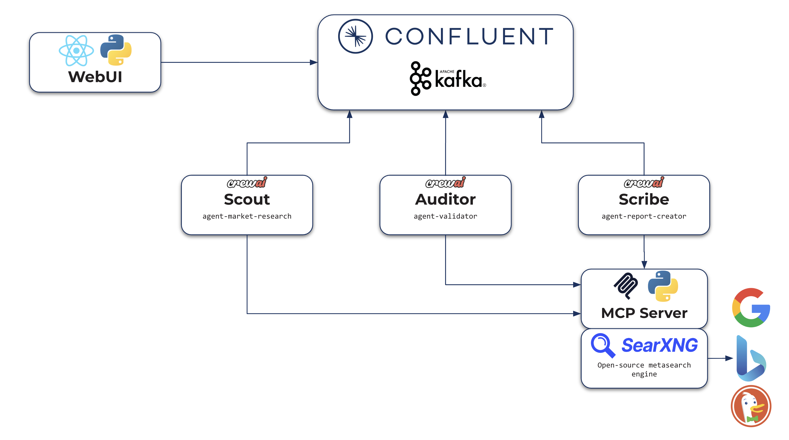
  <br/>
  <em>High-level view: the React/Flask UI and the three CrewAI agents (Scout, Auditor, Scribe)
  are fully decoupled — they exchange nothing directly, only messages on Confluent/Kafka topics.
  All three agents reach the live web through the MCP server's <code>web_search</code> tool, backed by SearXNG.</em>
</p>

The only control flow is "consume a topic, act, produce to a topic." No agent
imports or invokes another.

Bolted onto the same topics — without touching the agents — is an observability
layer: a Flink job refines the agents' activity log in-stream and an Elasticsearch
sink feeds a Kibana dashboard. Because everything is just another Kafka consumer,
it adds zero coupling to the agents. See
[Observability](#observability) and [Shift-left](#shift-left-processing-the-data-at-the-source).

## The agents

Each agent is a single-agent CrewAI crew running in its own container. The names
(used in the code and the UI) describe what each one does.

| Container | Name | Role | Consumes | Produces |
|---|---|---|---|---|
| `agent-market-research` | Scout | Researches the field/process on the web — latest improvements, how leaders innovate, new entrants, where VCs invest — and records source URLs | `crewai-ui-request-report` | `crewai-agent-market-research` |
| `agent-validator` | Auditor | Checks the research for coverage, coherence, evidence and specificity, re-checking cited URLs. Approves it or sends it back for another pass | `crewai-agent-market-research` | `crewai-agent-market-research-ready`, or `crewai-ui-request-report` to re-request |
| `agent-report-creator` | Scribe | Writes the executive report in Markdown from validated research | `crewai-agent-market-research-ready` | `crewai-agent-report-ready` |

All three can use the web-search tool exposed by the MCP server: Scout to gather
material, Auditor to re-verify references, Scribe to fill an occasional gap while
writing.

The validation loop is bounded so the system always finishes. Each request
carries a `counter`. When the Auditor rejects research, it republishes the
request with the prior findings in `report_draft`, its feedback in
`report_feedback`, and `counter + 1` — sending Scout back to revise (not redo)
that draft. The Auditor is tuned to approve workable research on the
first pass, so the loop is a safety valve rather than the normal path. Once the
research passes review, or `counter` reaches `MAX_RESEARCH_ITERATIONS` (2), it
moves on to the Scribe.

## Configuring the agents and the system

**Agent personas and prompts live in YAML, not in code.** Each agent reads a
`config.yaml` next to its source, so you can retune an agent — its role, goal,
backstory, task instructions, expected output, and iteration/time caps (and, for
the Auditor, the exact verdict tokens it must emit) — without touching Python:

- [`agents/market_research/config.yaml`](agents/market_research/config.yaml) — Scout
- [`agents/validator/config.yaml`](agents/validator/config.yaml) — Auditor
- [`agents/report_creator/config.yaml`](agents/report_creator/config.yaml) — Scribe

Where the YAML has `{placeholders}`, `crew.py` fills them at runtime: `{field}`
and `{process}` from the request, the `{findings}`/`{references}` passed between
agents, and `{extra}` (the Auditor's feedback on a re-research pass).

**System-wide settings live in [`common/settings.py`](common/settings.py).** This
is the single place that defines the knobs shared by every service: the Kafka
topic names, the service endpoints (broker, Schema Registry, MCP server, SearXNG)
with container-friendly defaults, the per-agent Bedrock model defaults
(`BEDROCK_MODEL_*`), the validation-loop cap (`MAX_RESEARCH_ITERATIONS`), and the
list of suggested sources injected into Scout's prompt. If you want to point at a
different broker, swap a model, or rename a topic, this is the file to read first.
Most values can also be overridden by an environment variable set in `.env` or
`docker-compose.yml`, so you rarely need to edit the file itself.

## Kafka topics and schemas

Every topic has one partition. The message key is the username (UTF-8). The value
is Avro, with schemas registered in the Confluent Schema Registry using
`TopicNameStrategy` (the subject for each topic is `<topic>-value`). The schema
files are in [`schemas/`](schemas/).

| Topic | Value schema | Produced by |
|---|---|---|
| `crewai-ui-request-report` | `ui_request_report.avsc` | the UI, and the Auditor when re-requesting |
| `crewai-agent-market-research` | `agent_market_research.avsc` | Scout |
| `crewai-agent-market-research-ready` | `agent_market_research_ready.avsc` | Auditor |
| `crewai-agent-report-ready` | `agent_report_ready.avsc` | Scribe |
| `crewai-logs` | `logs.avsc` | every agent (one message per LLM prompt, LLM response, and MCP tool call) |
| `crewai-logs-stats` | *(registered by Flink)* | the Flink job — a curated mirror of `crewai-logs` (drops the bulky `data` field, adds `latency_ms`); read by the UI and the Elasticsearch sink (see [Shift-left](#shift-left-processing-the-data-at-the-source)) |

A one-shot `kafka-setup` service creates the topics (one partition each) and
registers the schemas before any traffic flows, so they appear in Control Center
immediately; the Flink job and the UI wait for it to finish. Producers also
auto-register their schema on first publish, and the Flink job owns and registers
the `crewai-logs-stats-value` schema.

<p align="center">
  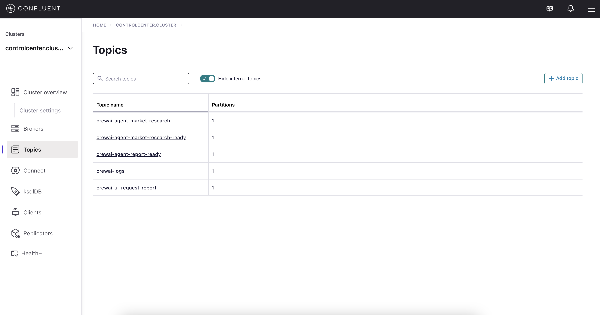
  <br/>
  <em>The core project topics in Confluent Control Center — one partition each (internal topics hidden).
  The Flink-derived <code>crewai-logs-stats</code> joins them once a run starts.</em>
</p>

## How a request flows through the system

1. A user logs in (username only) and submits a field and a process. The Flask
   backend publishes a request to `crewai-ui-request-report` with `counter = 0`
   and `report_draft = report_feedback = null`.
2. Scout consumes the request, researches the topic with the `web_search` tool
   (backed by SearXNG), and publishes its findings and source URLs to
   `crewai-agent-market-research`.
3. Auditor consumes the findings and reviews them, re-checking some of the cited
   URLs. If the research holds up — or the iteration cap is reached — it publishes
   to `crewai-agent-market-research-ready`. Otherwise it republishes the request
   with the prior draft, its feedback, and an incremented counter, and Scout
   revises that draft rather than starting over.
4. Scribe consumes the validated research and writes the report, publishing
   Markdown to `crewai-agent-report-ready`.
5. The Flask backend runs background consumers on `crewai-agent-report-ready` and
   `crewai-logs-stats`. It matches each message to the right user by the Kafka key
   (the username) and pushes them to the browser over Server-Sent Events, so the
   user sees a live activity feed and then the finished report.

In parallel, a Flink job continuously reads `crewai-logs`, shapes each event into
the leaner `crewai-logs-stats` stream, and writes it back to Kafka — feeding both
the UI feed above and the Elasticsearch/Kibana dashboard. See
[Shift-left](#shift-left-processing-the-data-at-the-source).

<p align="center">
  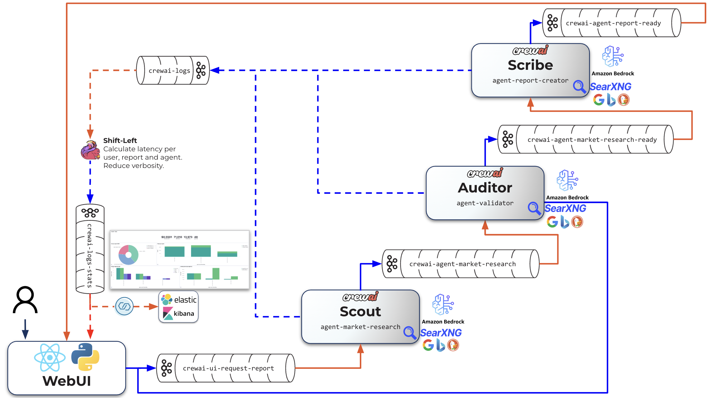
  <br/>
  <em>The same flow at the topic level. Solid arrows are produces (blue) and consumes (orange) between
  agents and topics; the dashed lines are the bounded re-research loop (Auditor → <code>crewai-ui-request-report</code>)
  and every agent streaming its activity to <code>crewai-logs</code>, which the UI tails for the live feed.
  No agent calls another — each only reads one topic and writes another.</em>
</p>

## Which LLMs it uses, and why

The agents run on Anthropic's Claude models hosted on Amazon Bedrock. CrewAI 1.x
talks to Bedrock through its native provider (boto3); the LiteLLM runtime is not
involved (only its public price map is read, for cost estimates — see
[Observability](#observability)). The model is chosen per agent to match the work
and balance cost against quality.

| Agent | Default model | Reasoning |
|---|---|---|
| Scout (research) | Claude Sonnet 4.6 | Research is a long loop of many search calls and synthesis. Sonnet gives a strong balance of speed and capability without paying Opus rates on every step. |
| Auditor (validation) | Claude Sonnet 4.6 | Validation is focused reasoning over a bounded input. Sonnet judges coverage and re-checks URLs reliably. Swap to Haiku if cost matters more than thoroughness. |
| Scribe (report) | Claude Opus 4.8 | The report is the graded deliverable, judged on clarity and structure. Opus writes the best long-form prose, and it runs only once per report. |

Each model is set by an environment variable, with defaults in
[`common/settings.py`](common/settings.py). Override them in `.env` or
`docker-compose.yml` to match what your account has enabled:

```
BEDROCK_MODEL_RESEARCH   (agent-market-research)
BEDROCK_MODEL_VALIDATOR  (agent-validator)
BEDROCK_MODEL_REPORT     (agent-report-creator)
```

## AWS Bedrock setup

The agents call Claude on Amazon Bedrock in the `eu-west-1` region.

1. **Provide credentials.** Copy the template and fill in your keys:
   ```bash
   cp .env_example .env
   ```
   Then set these in `.env`:
   ```
   export AWS_ACCESS_KEY_ID="..."
   export AWS_SECRET_ACCESS_KEY="..."
   export AWS_REGION_NAME="eu-west-1"
   ```
   `.env` is git-ignored; `.env_example` is the committed template and also holds
   the Confluent Platform image versions (`CP_*`).

2. **Enable model access.** In the AWS console, open Bedrock → Model access in
   `eu-west-1` and enable the Claude models you plan to use (Sonnet and Opus).
   Access is granted per region.

3. **Use EU inference-profile model IDs.** In `eu-west-1`, Claude is reached
   through EU cross-region inference profiles, so model IDs carry an `eu.` prefix,
   for example `bedrock/eu.anthropic.claude-sonnet-4-6`. Newer Claude models are
   often callable *only* through an inference profile; the bare
   `anthropic.claude-…` id returns an error.

4. **Grant IAM permissions.** The credentials need at least:
   ```
   bedrock:InvokeModel
   bedrock:InvokeModelWithResponseStream
   ```
   on the model and inference-profile ARNs.

Model availability differs by region and changes over time. Older models may be
marked legacy and rejected even when "enabled." If an agent logs an
`AccessDenied`, `ResourceNotFound`, or `ValidationException` from Bedrock, set the
`BEDROCK_MODEL_*` variables to a currently active model in your region. You can
list what is active with:

```bash
aws bedrock list-foundation-models --by-provider Anthropic --region eu-west-1 \
  --query "modelSummaries[?modelLifecycle.status=='ACTIVE'].modelId"
```

## Running it

Prerequisites: Docker Desktop with Compose v2, an AWS account with Bedrock Claude
access in `eu-west-1`, and roughly 8 GB of free RAM for the Confluent stack.

```bash
cp .env_example .env     # then add your AWS credentials (see above)
./start_demo.sh
```

`start_demo.sh` checks that Docker is running and `.env` exists, then builds and
starts the whole stack: Confluent Platform (broker, Schema Registry, Control
Center, Connect, **Flink**), **Elasticsearch + Kibana**, SearXNG, the MCP server,
the three agents, and the UI. The one-shot `kafka-setup` service creates the topics
and registers the schemas; the Flink job that builds `crewai-logs-stats` is then
submitted. Finally the script applies the Elasticsearch index template, deploys the
Elasticsearch sink connector, and imports the Kibana dashboard — then prints the
service URLs. The first run builds images and pulls the Confluent, Elasticsearch
and Kibana images, so it takes several minutes.

| Service | URL |
|---|---|
| Research console (the UI) | http://localhost:8088 |
| Confluent Control Center | http://localhost:9021 |
| Schema Registry | http://localhost:8081 |
| Prometheus | http://localhost:9090 |
| Kafka Connect (REST) | http://localhost:8083 |
| Flink Dashboard | http://localhost:9081 |
| Elasticsearch | http://localhost:9200 |
| Kibana (AI observability dashboard) | http://localhost:5601/app/dashboards |

## Using the web UI

<p align="center">
  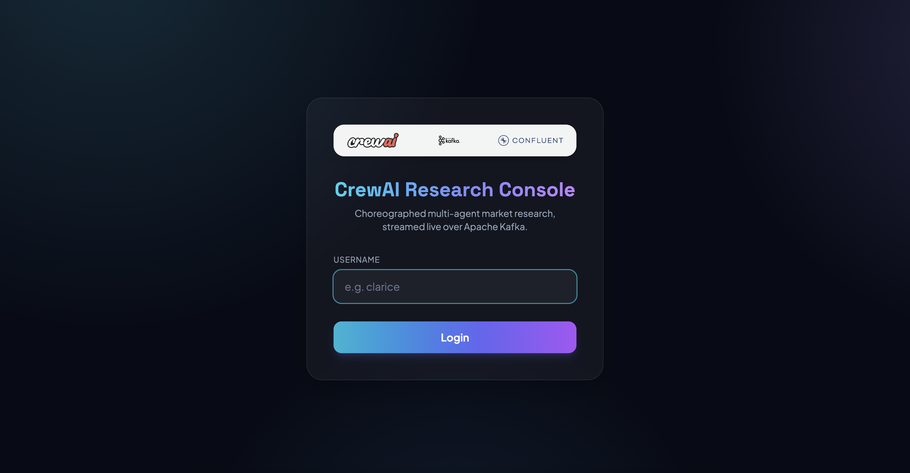
  <br/>
  <em>Username-only login (no password). The username opens a session and becomes the Kafka
  message key, which scopes the live feed and report to you.</em>
</p>

1. Open http://localhost:8088 and log in with any username. There is no password;
   the username creates a session and becomes the Kafka message key.
2. Choose a field from the dropdown and describe the process in the text box (for
   example, *Technology* + *AI code review*, or *Finance* + *procure-to-pay*).
   Submit stays disabled until a field is selected and the process has at least a
   few characters.
3. Click Submit. Use Clear to reset the form.
4. Watch the Agent activity panel: every LLM prompt and response — and every MCP
   web-search call — from Scout, Auditor, and Scribe streams in live from
   `crewai-logs-stats` (the Flink-curated stream). Each line shows the agent, what
   it's doing, the call's token count and estimated cost; the header keeps running
   session token and cost totals.
5. When the Scribe finishes, the report renders on the right. Use the Download
   button to save it as Markdown.

A full run takes a few minutes — it includes real web research, validation, a
possible re-research loop, and writing.

<p align="center">
  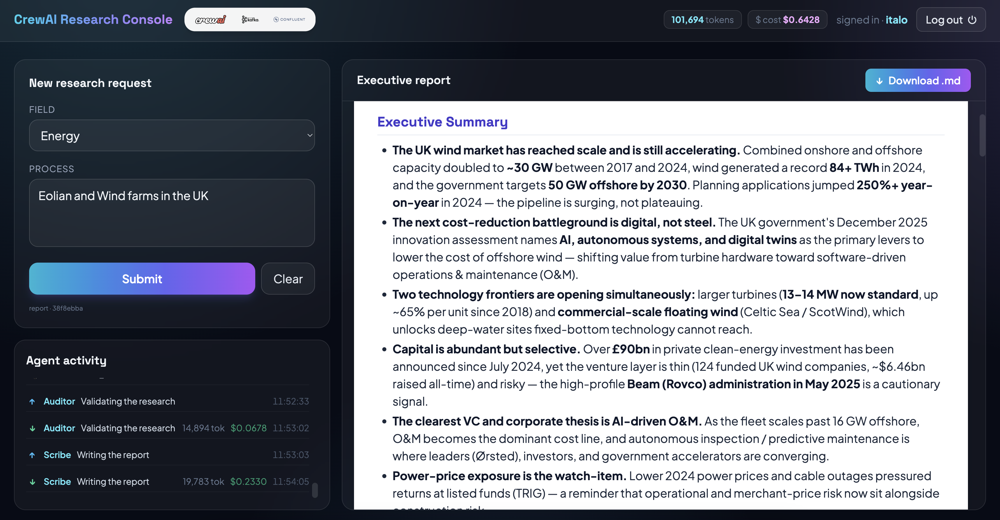
  <br/>
  <em>The console mid-run: the request form and the live agent-activity feed on the left, the
  streamed executive report on the right, and session token/cost totals in the header.</em>
</p>

## Stopping it

```bash
./stop_demo.sh             # stop and remove containers, keep Kafka data
./stop_demo.sh --volumes   # also remove volumes for a clean slate
```

Stopping sends each container SIGTERM. The agents and the UI catch it and shut down
gracefully — they stop their Kafka consumers cleanly (committing offsets, leaving the
group) and flush any pending producer messages before exiting, so no in-flight log or
report is lost. The handling lives in [`common/lifecycle.py`](common/lifecycle.py).

## Observability

- **In the UI:** the activity feed shows every agent action — LLM prompts and
  responses *and* MCP tool calls — read from `crewai-logs-stats`, with per-call
  token counts and an estimated USD cost, plus running session totals in the header.
- **In Kibana** (http://localhost:5601/app/dashboards): the *CrewAI · AI Agent
  Observability* dashboard — tokens and cost per agent, LLM/tool call counts, and
  per-call latency, all from `crewai-logs-stats` (see below).
- **In Control Center** (http://localhost:9021): topics, message flow, consumer
  groups, the registered Avro schemas, the Flink job, and the Connect cluster.
- **In the container logs:**
  `docker compose logs -f agent-market-research agent-validator agent-report-creator`.

The log feed is produced by a listener on CrewAI's event bus
([`common/logging_bus.py`](common/logging_bus.py)). It captures every LLM call
(prompt, response, model, real token usage) and every MCP tool call (name,
arguments, result), and publishes each to `crewai-logs`, tagged with the agent
name, `report_id`, and username. Token counts come from the provider's actual
usage rather than an estimate. The USD cost is derived from LiteLLM's maintained
public price map — the same one CrewAI references — so no prices are hardcoded;
a model not yet in the map simply shows as `n/a` ([`common/pricing.py`](common/pricing.py)).

<p align="center">
  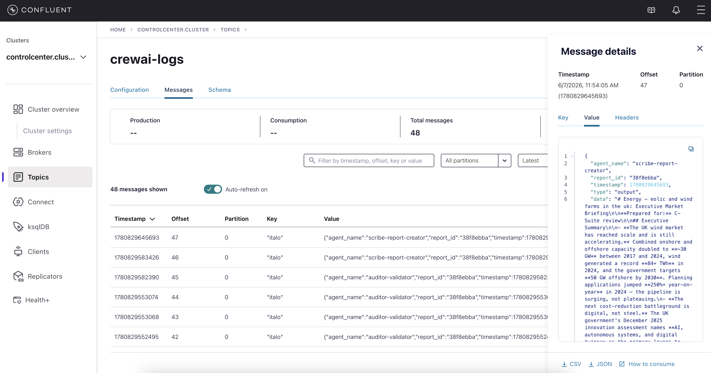
  <br/>
  <em>Inspecting <code>crewai-logs</code> in Control Center: each message is one agent action keyed by
  username, with the Avro value (<code>agent_name</code>, <code>report_id</code>, <code>type</code>, <code>tokens</code>,
  <code>cost</code>, <code>model</code>) shown in the message detail.</em>
</p>

### The Elastic/Kibana observability dashboard

On top of the raw `crewai-logs` topic sits a small observability stack. A Flink
job turns the raw log into the curated `crewai-logs-stats` stream, and a
**Confluent Elasticsearch Sink connector** streams that topic straight into
Elasticsearch, where **Kibana** charts it. The connector is deployed automatically
by `start_demo.sh` (config in [`connectors/`](connectors/)); nothing is exported by
hand.

<p align="center">
  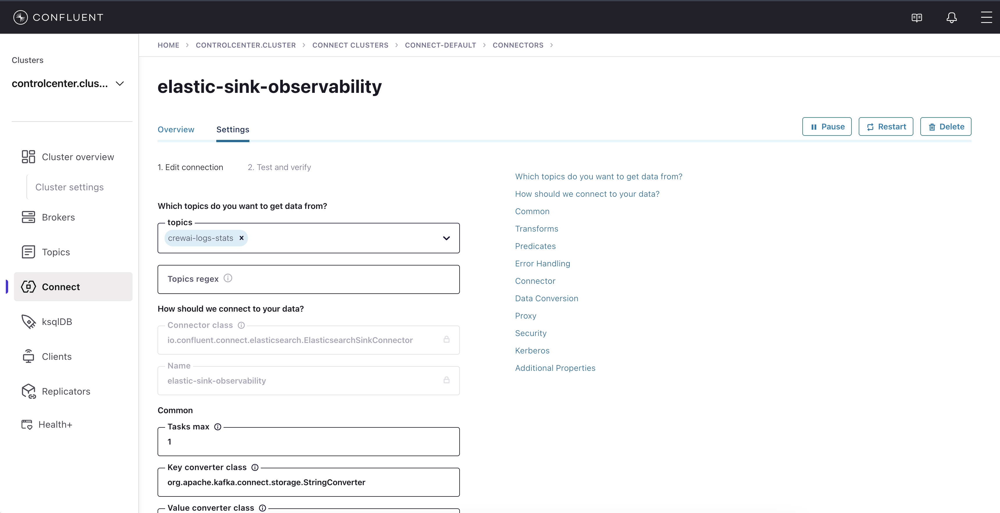
  <br/>
  <em>The <code>elastic-sink-observability</code> connector in Control Center, reading <code>crewai-logs-stats</code>
  and sinking it to Elasticsearch — no bespoke consumer code.</em>
</p>

The imported **CrewAI · AI Agent Observability** dashboard (saved object in
[`kibana_dashboard.ndjson`](kibana_dashboard.ndjson)) answers the questions you
actually have about an agentic system: how much each agent costs and how many
tokens it burns, how many LLM and tool calls each one makes, and how long those
calls take — average and max — per agent and per report.

<p align="center">
  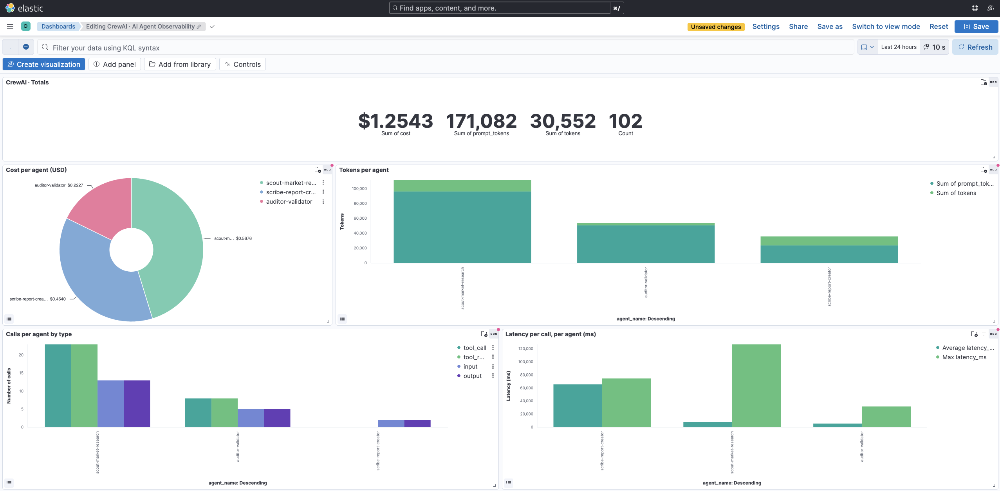
  <br/>
  <em>Totals (cost in USD, input/output tokens, event count), cost per agent, tokens per agent,
  LLM/tool calls per agent by type, and average/max latency per call per agent.</em>
</p>

<p align="center">
  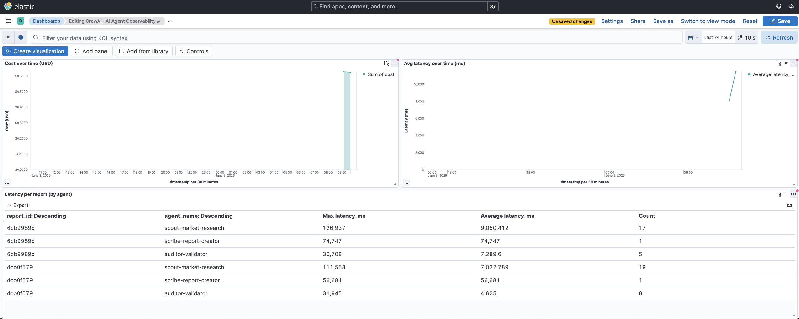
  <br/>
  <em>Cost and average latency over time, and a table of max/average latency per <code>report_id</code> and agent.
  Every panel is driven solely by <code>crewai-logs-stats</code>.</em>
</p>

## Shift-left: processing the data at the source

The latency on that dashboard is never computed in Elasticsearch, and the bulky
prompt/response text never reaches it. Both are handled upstream, in the stream
itself — an example of the [shift-left](https://www.confluent.io/learn/what-is-shift-left/)
approach to data: do the cleaning, shaping, enrichment and governance *close to
where the data is produced*, once, instead of re-doing it downstream in every
system that consumes it.

The classic ("shift-right") pattern would be to dump every raw log into
Elasticsearch and then transform it there — recomputing latency with a transform
or scripted field, carrying the heavy `data` payload into the index, and repeating
that work in any other consumer. That means more storage, redundant compute, slower
queries, and quality logic scattered across tools.

Here a single **Confluent Platform Flink** job (DDL in [`sql/bootstrap.sql`](sql/bootstrap.sql))
does the work in motion, the moment each event lands on `crewai-logs`:

- **Trims the payload** — drops the large free-text `data` field that neither the
  UI nor the dashboard needs.
- **Enriches** — computes per-call `latency_ms` as the gap between consecutive
  events for the same `(username, report_id)` (`LAG(...) OVER (...)`), so latency is
  a first-class field instead of something each consumer has to derive.
- **Keeps the contract** — writes Avro to `crewai-logs-stats` against the Schema
  Registry, carrying the username on both the key (for the UI's per-user fan-out)
  and in the value (for Elasticsearch).

<p align="center">
  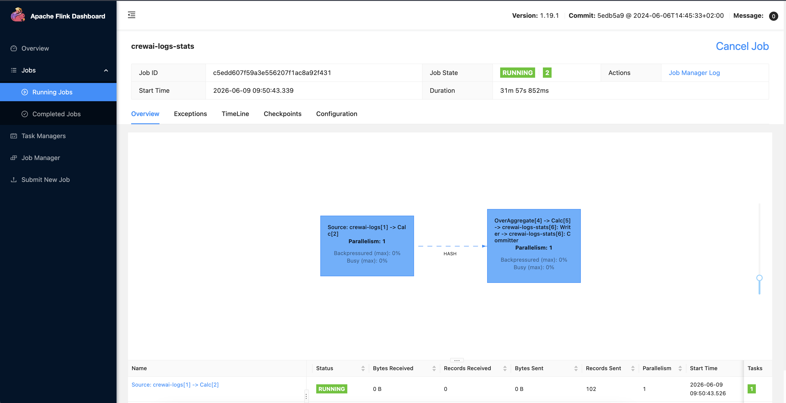
  <br/>
  <em>The Flink job: <code>Source: crewai-logs → Calc → OverAggregate → crewai-logs-stats Writer</code>.
  It strips <code>data</code> and computes <code>latency_ms</code> continuously, in-stream.</em>
</p>

The result is **one curated data product, built once at the source and reused
everywhere**: the same `crewai-logs-stats` topic feeds the live UI feed *and* the
Elasticsearch/Kibana dashboard, with consistent fields, real-time freshness, lower
downstream cost, and quality enforced by the schema rather than by each consumer.

<p align="center">
  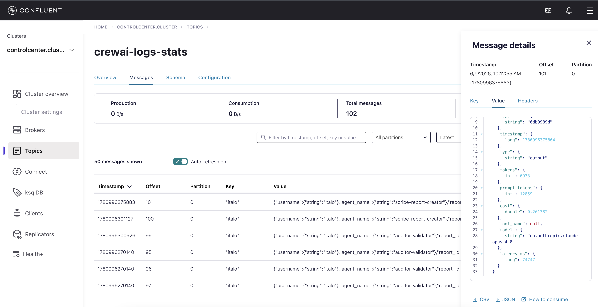
  <br/>
  <em>The shifted-left <code>crewai-logs-stats</code> stream: <code>data</code> is gone and <code>latency_ms</code> is already
  present in the Avro value — ready for Elasticsearch with no further processing.</em>
</p>

## Extend it

This is a deliberately small example: enough to show the pattern, not a production
system. That is also what makes it a good starting point. Because there is no
orchestrator, adding a capability means adding one more Kafka consumer — nothing
central has to be rewired. If you want to go further, try building one of these.
Each is roughly a weekend-sized project.

- **Source curator.** A new agent on `crewai-agent-market-research` that dedupes
  and ranks references and scores their credibility before validation.
- **Competitor intelligence.** An agent that deep-dives the companies Scout names
  (funding, headcount, products) through a Crunchbase or CB Insights MCP tool.
- **Compliance / PII check.** An agent that screens the report against a policy
  before it reaches the user.
- **Publisher.** An agent that renders the Markdown to PDF or PPTX and delivers it
  (email, object storage, a Slack message).
- **Human in the loop.** A `report-review` topic and a UI control that lets a
  person approve a report before it is published.
- **Make it elastic.** Increase a topic's partitions and run several copies of an
  agent in the same consumer group to process requests in parallel.

If you build something interesting, the architecture is designed to welcome it:
write the consumer, give it a topic, add it to `docker-compose.yml`, and the rest
of the system carries on as before.

## Repository layout

```
.
├── common/                     Shared library (settings, Kafka+Avro, Bedrock LLM, MCP, logging, pricing, lifecycle)
├── schemas/                    Avro value schemas, one per topic
├── sql/bootstrap.sql           Flink DDL: derive crewai-logs-stats from crewai-logs (drop data, add latency_ms)
├── connectors/                 Elasticsearch sink connector config + ES index template
├── kibana_dashboard.ndjson     The "CrewAI · AI Agent Observability" Kibana saved objects
├── docs/imgs/                  Screenshots and diagrams used in this README
├── scripts/                    kafka-bootstrap.sh (topics + schemas), flink-bootstrap.sh (submit job), register_schemas.sh
├── mcp_server/                 MCP server exposing a web_search tool over SearXNG
├── searxng/settings.yml        SearXNG configuration (JSON API enabled)
├── agents/                     One folder per agent (main.py, crew.py, config.yaml, Dockerfile)
│   ├── market_research/        Scout   (request → research)   — persona in config.yaml
│   ├── validator/              Auditor (research → validated, or re-request)
│   └── report_creator/         Scribe  (validated → report)
├── ui/                         Flask + SSE backend, static React (CDN, no build step)
├── docker-compose.yml          Confluent Platform (broker, SR, C3, Connect, Flink) + Elastic/Kibana + SearXNG + MCP + agents + UI
├── start_demo.sh / stop_demo.sh
├── .env_example                Copy to .env and add your AWS credentials
└── samples/                    An example generated report
```
